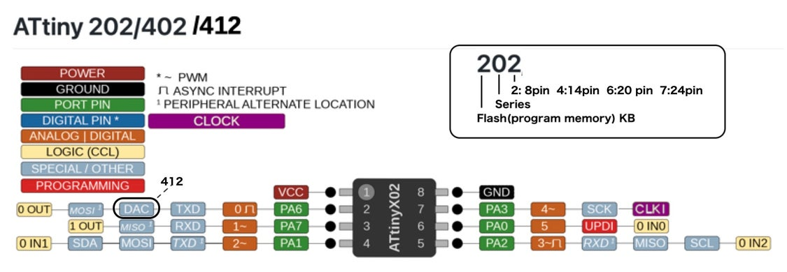
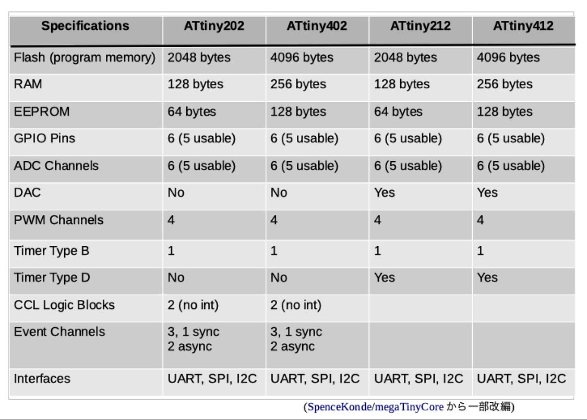
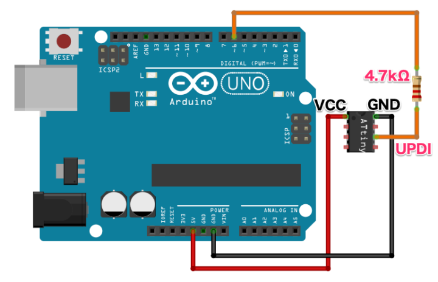
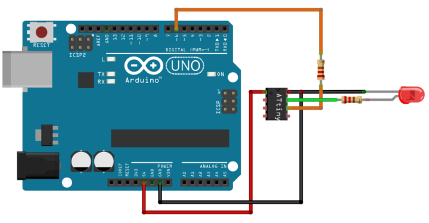
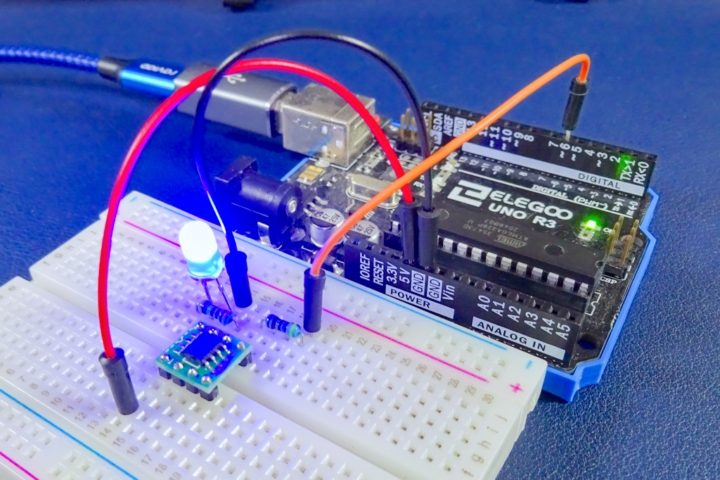

# P-BrakeIndicator

**P-BrakeIndicator:** An ATtiny202-based automotive buzzer alert system to prevent driving with the handbrake engaged.

Компактний автомобільний пристрій контролю стоянкового гальма на мікроконтролері **ATtiny202** (серія tinyAVR 0). Система моніторить положення важеля ручника та активує звукове сповіщення у разі спроби руху з піднятим ручним гальмом, запобігаючи передчасному зносу гальмівної системи автомобіля.

---

## 🛠️ Апаратне забезпечення та інструменти

* **Мікроконтролер:** ATtiny202 (в корпусі SOIC-8).
* **Програматор:** USB-UART (TTL) адаптер на базі чіпа **QinHeng Electronics HL-340**.
* **Додатково:** Резистор **4.7 кОм** (або діод на кшталт 1N4148 / червоний світлодіод) для створення лінії SerialUPDI.

---

## 📊 Розпіновка та Специфікація (Pinout & Specification)

Для зручності монтажу та проектування нижче наведено схему розташування виводів мікроконтролера ATtiny202 (корпус SOIC-8) та його основні технічні характеристики:

<p align="center">
  
  
</p>

---

## 🔌 Схема підключення (SerialUPDI)

Оскільки інтерфейс UPDI є однопровідним, лінії TX та RX адаптера HL-340 об'єднуються через резистор:

```text
USB-UART HL-340                       ATtiny202 (SOIC-8)
   [ TX ] -----[ Резистор 4.7 кОм ]-----+
                                        |
   [ RX ] ------------------------------+------> Pin 6 (PA0 / UPDI)

   [ GND ] ------------------------------------> Pin 8 (GND)
   [ 3.3V ] -----------------------------------> Pin 1 (VCC)
```
Для кращого розуміння фізичного монтажу ліній зв'язку нижче наведено візуальну схему:

<p align="center">
  
</p>

⚠️ На цьому зображенні як апаратний міст показано плату Arduino. Проте **принцип об'єднання сигнальних ліній через резистор та підключення до чіпа повністю аналогічні нашому програматору** на базі USB-UART HL-340. Лінії передачі даних працюють за тією ж напівдуплексною логікою.

⚠️ **Важлива особливість для HL-340:** Адаптер видає логічні рівні 3.3 В. Для стабільної ініціалізації чіпа (щоб уникнути помилки `UPDI initialisation failed`), мікроконтролер ATtiny202 обов'язково має бути заживлений від **3.3 В**, а не від 5 В.

---

## 💻 Розробка за допомогою PlatformIO (Рекомендовано)

Для автоматизації збірки, керування життєвим циклом проєкту та комфортної роботи в текстових редакторах (наприклад, **Emacs**) використовується **PlatformIO Core**. 

Застарілий метод прошивки через `jtag2updi` більше **не працює**, тому конфігурація налаштована на пряме програмування через інтерфейс **SerialUPDI**.

### 1. Конфігурація `platformio.ini`
Рекомендованим способом ініціалізувати проект є виклик

``` shell
make init
```

або вручну

``` shell
platformio project init --ide emacs --board ATtiny202 \
--project-option "framework=arduino" \
--project-option "board_build.f_cpu=16000000L" \
--project-option "upload_protocol=serialupdi" \
--project-option "upload_speed=57600" \
# --project-option "upload_port=/dev/ttyUSB0"
# Автоматичне визначення або ручний вибір порту (за потреби розкоментуйте рядок вище)
```

Цей виклик згенерує структуру проекту і файл налаштувань `platformio.ini`. Додайте в кінець ці рядки:

``` ini
; Automatic detection or manual port selection (uncomment if needed)
; upload_port = /dev/ttyUSB0

[env:brake_indicator]
extends = env:ATtiny202
src_filter = +<brake_indicator.c> -<blink_test.c>

[env:blink_test]
extends = env:ATtiny202
src_filter = +<blink_test.c> -<brake_indicator.c>
```

Після ініціалізації проєкту файл налаштувань має містити параметри частоти, фіксованого порту та зниженої швидкості завантаження (`57600`), яка є критичною для стабільної роботи старого китайського чіпа HL-340 та профілі прошивки `brake_indicator` та `blink_test`:

```ini
[env:attiny202]
platform = atmelmegaavr
board = attiny202
framework = arduino
board_build.f_cpu = 16000000L
upload_protocol = serialupdi
upload_speed = 57600

; Automatic detection or manual port selection (uncomment if needed)
; upload_port = /dev/ttyUSB0

[env:brake_indicator]
extends = env:ATtiny202
src_filter = +<brake_indicator.c> -<blink_test.c>

[env:blink_test]
extends = env:ATtiny202
src_filter = +<blink_test.c> -<brake_indicator.c>
```

### 2. Керування проєктом через Makefile
Для швидкої збірки та прошивки безпосередньо з робочого оточення використовується дворівнева структура `Makefile`. Головний файл у корені проєкту автоматизує основні команди:

* `make init` — ініціалізує чистий проєкт для архітектури ATtiny202 з усіма необхідними параметрами прошивки та створює конфігурацію для Emacs.
* `make build` — компілює основний код програми (`brake_indicator.c`).
* `make upload` — прошиває мікроконтролер через підключений адаптер HL-340.
* `make upload-blink` — прошиває тестовий код блінка (`blink_test.c`) для перевірки заліза.
* `make clean` — очищає тимчасові файли збірки.
* `make monitor` — запускає монітор послідовного порту.

Внутрішній `src/Makefile` автоматично перенаправляє виклики на рівень вище за допомогою прапорця `-C ..`, що дозволяє запускати компіляцію чи прошивку прямо під час редагування файлу `src/main.cpp`.

## ⚙️  Альтернативне налаштування в Arduino IDE

1. Встановіть ядро **megaTinyCore** від SpenceKonde, додавши це посилання в менеджер плат:
   `https://github.com/SpenceKonde/megaTinyCore`
2. Перейдіть в **Інструменти** (Tools) та виберіть такі налаштування:
   * **Плата (Board):** megaTinyCore ➔ ATtiny202/402/212/412 (БЕЗ Optiboot!) *(Окремого пункту Bootloader немає, вибір інтегровано сюди)*
   * **Chip:** ATtiny202
   * **Clock:** 16 MHz internal
   * **Programmer:** `SerialUPDI - 57600 baud` *(Швидкість 57600 є критичною для стабільної роботи старого чіпа HL-340)*
   * **Port:** Ваш COM-порт (наприклад, `/dev/ttyUSB0` у Linux)

---

## 🚀 Як завантажити код

1. Підключіть тестовий світлодіод довгою ніжкою до **ніжки 2 (PA6)**, а короткою через резистор 220 Ом до **GND**.
2. Перевірте, що в меню вибору плат активовано саме варіант **(БЕЗ Optiboot!)**.
3. Натисніть стандартну кнопку **«Вантажити» (Upload)** в Arduino IDE. Програма автоматично викличе SerialUPDI та завантажить скетч.

---

## 📝 Тестовий скетч

У коді для PlatformIO обов'язково підключається заголовок `<Arduino.h>`, а піни задаються через системні константи. Для цього тесту світлодіод підключається до порту **PA3**, що фізично відповідає **ніжці 7** мікроконтролера ATtiny202.

Схема підключення світлодіода для перевірки працездатності:

<p align="center">
  
</p>

### Код програми (`src/blink_test.c`)

```c
#include <Arduino.h>

// Для ATtiny202 в PlatformIO піни позначаються через PIN_PA6, PIN_PA7 тощо.
// Фізична ніжка 7 чіпа — це порт PA3.
const uint8_t LED_PIN = PIN_PA3; 

void setup() {
  pinMode(LED_PIN, OUTPUT);
}

void loop() {
  digitalWrite(LED_PIN, HIGH);
  delay(1000);
  digitalWrite(LED_PIN, LOW);
  delay(1000);
}
```

### Результат роботи

Після успішного завантаження програми світлодіод почне блимати з інтервалом в одну секунду, як показано на зображенні:

<p align="center">
  
</p>

---

## 🔊 Схема підключення звукового випромінювача (2Т7000 MOSFET)

Для відтворення мелодії пасивний динамік або зумер підключається через N-канальний польовий транзистор **2N7000** за схемою Low-Side Switch. Для стабільної роботи без просідання живлення та захисту від перезавантаження мікроконтролера обов'язково використовуються обмежувальний, затворний та підтягуючий резистори:

* **Gate (Затвор / Ніжка 2 транзистора):** Підключається до виходу **PA3 (Ніжка 7 чіпа)** через обмежувальний резистор.
* **Source (Витік / Ніжка 1 транзистора):** Підключається жорстко на **GND (Мінус / Маса)**.
* **Drain (Стік / Ніжка 3 транзистора):** Підключається до мінусового виводу динаміка.
* **Резистор 100–220 Ом (Gate Resistor):** Встановлюється у розрив лінії між виводом **PA3** та Затвором (Gate) для гасіння високочастотного дзвону та обмеження зарядного струму затвора.
* **Резистор 10 кОм (Pull-Down):** Встановлюється між Затвором (Gate) та Витоком (Source) для надійного закриття транзистора, коли мікроконтролер мовчить.
* **Резистор 100 Ом (Струмообмежувальний):** Підключається послідовно з динаміком у розрив ланцюга живлення **VCC (+3.3V / +5V)** для захисту лінії від імпульсних просідань напруги.

---

## 🔗 Корисні посилання
* [Посилання на специфікацію ATtiny202](https://ameblo.jp/pta55/entry-12784013578.html)
*Зверніть увагу: застарілий метод прошивки через `jtag2updi` більше **не працює** з новими версіями ядер, тому використовується пряме програмування через SerialUPDI.*
* [Детальна інструкція з налаштування середовища розробки ATtiny202 в Arduino IDE](https://burariweb.info)
